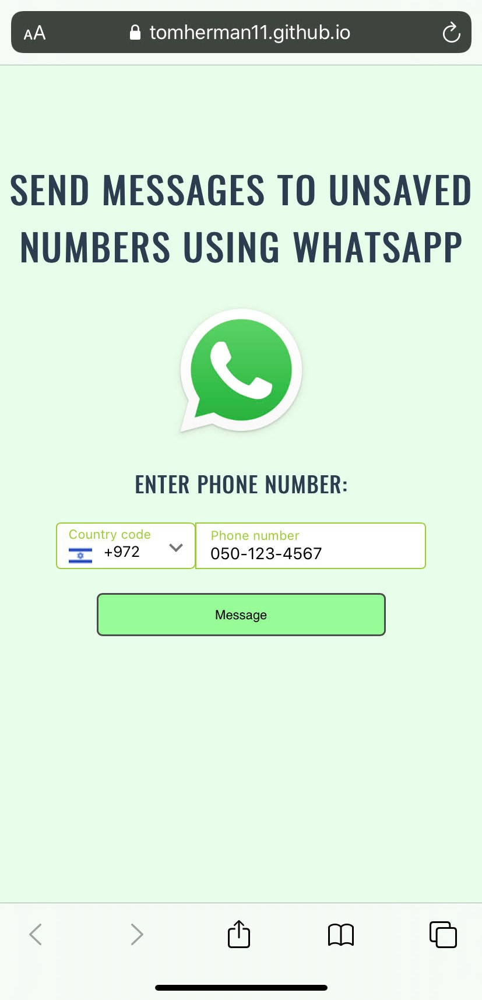

# vue-whatsapp-message-unsaved-number

## This is my first Vue.js project :) ##

## Walkthrough: ##
- Choose a country
- Enter the unsaved phone number
- Click the 'Message' button
- Viola!
- A new tab opens and you can send a WhatsApp message to the unsaved number you just entered.

This project is deployed and available to the public at:  
https://tomherman11.github.io/vue-whatsapp-message-unsaved-number/
